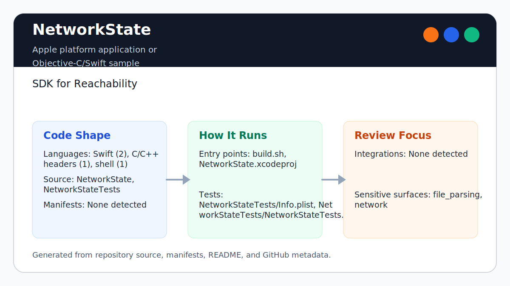

# NetworkState

<!-- README-OVERVIEW-IMAGE -->


## Overview

`garethpaul/NetworkState` is a small Swift framework that wraps
SystemConfiguration reachability as `NetworkState.isConnectedToNetwork()`.

This README is based on the checked-in source, manifests, scripts, and repository metadata on the `master` branch. The project language mix found during review was: Swift (2), C/C++ headers (1), shell (1).

## Repository Contents

- `README.md` - project overview and local usage notes
- `build.sh` - Xcode build/test runner with environment overrides
- `CHANGES.md` - baseline change log
- `Makefile` - host-portable static verification entry point
- `NetworkState` - Swift reachability framework source
- `NetworkState.xcodeproj` - Xcode project file
- `NetworkState.podspec` - CocoaPods package metadata
- `NetworkStateTests` - XCTest smoke coverage for the public API
- `SECURITY.md` - security reporting and disclosure guidance
- `VISION.md` - project direction and maintenance guardrails
- `docs/plans/2026-06-08-network-state-baseline.md` - completed hardening plan
- `scripts/check-baseline.py` - static baseline checks used by `make check`

Additional scan context:

- Source directories: NetworkState, NetworkStateTests
- Dependency and build manifests: `NetworkState.podspec`, `.travis.yml`
- Entry points or build surfaces: build.sh, NetworkState.xcodeproj
- Test-looking files: NetworkStateTests/Info.plist, NetworkStateTests/NetworkStateTests.swift

## Getting Started

### Prerequisites

- Git
- macOS with Xcode for building Apple platform projects
- Python 3 for static checks
- CocoaPods when validating the podspec with `pod spec lint`

### Setup

```bash
git clone https://github.com/garethpaul/NetworkState.git
cd NetworkState
make lint
make test
make build
make check
```

The setup commands above are derived from repository files. Legacy mobile, Python, or JavaScript samples may require older SDKs or package versions than a modern workstation uses by default.

## Running or Using the Project

- Import the framework and call `NetworkState.isConnectedToNetwork()` to receive a local boolean connectivity signal.
- `NetworkState.isReachableWithFlags(_:)` keeps reachability flag evaluation testable for fixture-style checks.
- Automatic connection reachability flags are considered reachable when no user intervention is required.
- Automatic connection handling still requires the reachable flag, so connection-on-demand flags alone do not report connectivity.
- Combined automatic connection flags remain reachable when the base reachable
  flag is present and no user intervention is required.
- The intervention-required flag prevents reachability even when the base
  reachable flag is present.
- The automatic intervention matrix covers on-demand, on-traffic, and combined
  automatic modes so none report connectivity while user action is required.
- The non-reachability flag guard verifies transient, local-address, and direct
  bits cannot create connectivity without the `Reachable` flag.
- Open `NetworkState.xcodeproj` in Xcode and run the `NetworkStateTests` scheme.
- Run `./build.sh` when the required platform toolchain is installed. Override the simulator when needed:
- The build script defaults `CODE_SIGNING_ALLOWED=NO` for simulator validation;
  override it only when intentionally testing signing behavior.
- The Xcode project deployment targets align with the podspec's declared iOS 8.0 support.
- Framework version alignment keeps `NetworkState/Info.plist` on the same
  public version as `NetworkState.podspec`.
- The shared framework scheme keeps the `NetworkState.framework` target
  available to Xcode consumers alongside the test scheme.

```bash
DESTINATION='platform=iOS Simulator,name=iPhone 6' ./build.sh
```

## Testing and Verification

- `make lint`
- `make test`
- `make build`
- `make check`
- Pinned `macos-15` GitHub Actions runs the SDK-free baseline and parses
  `NetworkState.xcodeproj` without simulator execution, signing, pod
  publishing, or runtime connectivity checks.
- `./build.sh` on macOS with Xcode
- `pod spec lint NetworkState.podspec` when preparing CocoaPods release metadata
- XCTest coverage includes reachable, connection-required, and unreachable reachability flag combinations.

The Make targets run the same SDK-free static baseline on non-macOS hosts. Use
`./build.sh` or Xcode for the full framework test run when the legacy toolchain
is available.

When the required SDK or runtime is unavailable, use static checks and source review first, then verify on a machine that has the matching platform toolchain.

## Configuration and Secrets

- No required secret or credential file was identified in the repository scan.
- Keep signing identities, local xcconfig files, environment files, and generated build output out of git.

## Security and Privacy Notes

- The library uses `SystemConfiguration` reachability and should keep checks local to the device.
- Reachability flag evaluation should remain covered by fixture-style tests rather than relying only on live network state.
- Automatic connection reachability flags should stay covered so connection-on-demand paths do not report false negatives.
- Automatic connection behavior should keep the rule that it requires the reachable flag.
- Combined automatic connection flags should stay covered so on-demand and
  on-traffic states remain accepted together.
- The intervention-required flag should keep user-action states from reporting
  connected.
- The automatic intervention matrix should keep every automatic connection mode
  unreachable while intervention is required.
- Preserve the non-reachability flag guard when adding ancillary flag handling.
- Review changes touching network requests, sockets, telemetry, or service endpoints; examples from the scan include NetworkState/Info.plist, NetworkStateTests/Info.plist.
- Review changes touching file, media, JSON, XML, CSV, OCR, or data parsing; examples from the scan include NetworkState/Info.plist, NetworkStateTests/Info.plist.

## Maintenance Notes

- This looks like an Apple platform project or sample. Xcode, Swift, CocoaPods, and deployment target versions may need to match the original project era.
- Run `make lint`, `make test`, `make build`, and `make check` before pushing
  changes, then run Xcode and CocoaPods verification on macOS when package
  metadata or Swift behavior changes.
- Keep `NetworkState.podspec` and Xcode deployment targets aligned so package metadata does not claim unsupported iOS versions.
- Keep framework version alignment between `NetworkState/Info.plist` and
  `NetworkState.podspec` before publishing package metadata.
- Keep the shared framework scheme aligned with the `NetworkState.framework`
  target so Xcode consumers can build the framework directly.
- Keep combined automatic connection flags covered in fixture-style tests before
  changing reachability evaluation.
- See `docs/plans/2026-06-09-make-gate-aliases.md` for the standard local gate
  aliases.
- See `SECURITY.md` for vulnerability reporting and safe research guidance.
- See `VISION.md` for project direction and contribution guardrails.

## Contributing

Keep changes small and tied to the project that is already present in this repository. For code changes, document the toolchain used, avoid committing generated dependency directories or local configuration, and update this README when setup or verification steps change.
